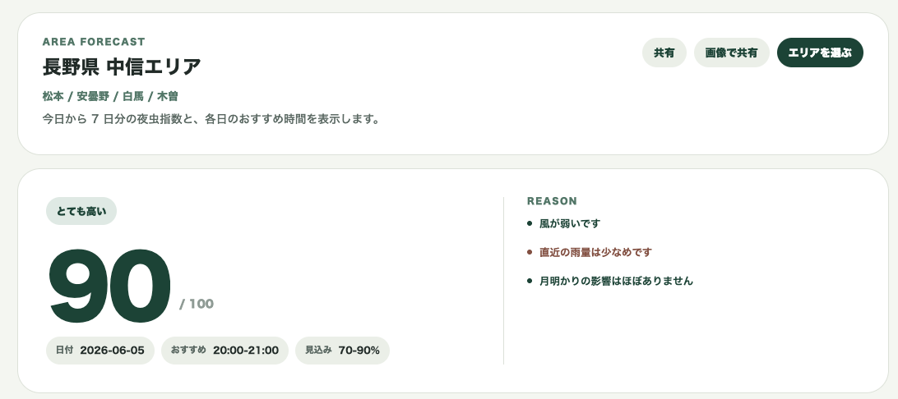

# yoru-mushi-index



夜虫指数は、夜間に飛翔する昆虫の観察コンディションをエリア単位で推定する Web アプリです。

気温、湿度、風、雨、雲量、月条件、季節、広域環境から「今夜このエリアで虫が飛びやすいか」を 0-100 の指数として表示します。見込みは観察条件の良さの目安で、実際の出現数や採集成果を保証するものではありません。

表示対象は各日の夜 19:00-23:00 です。画面では、最も条件が良い対象時刻、スコア理由、分類別スコア、取得した気象・月条件、7 日分の指数を確認できます。

## Production

```txt
https://yorumushi.com
```

`www.yorumushi.com` は `yorumushi.com` へリダイレクトします。

## Features

- 対応エリアの選択
- 今日の夜 19:00-23:00 を対象にした夜虫指数
- 対象日、対象時刻、最終計算時刻の表示
- 7 日分の指数と日別のおすすめ時間
- 時間別スコアと代表時刻の条件表示
- 気温、風、雨、湿度、月明かり、季節によるスコア理由
- 蛾、甲虫、水辺の羽虫の分類別スコア
- 指数カードの画像共有
- 地点情報ポリシー、スコア、データソース説明ページ

## Data and safety

- Weather: Open-Meteo hourly forecast
- Moon: SunCalc
- Cache: Open-Meteo への取得は 1 時間キャッシュ
- Weekly forecast: 起点日の前日から 7 日目までを 1 回の Open-Meteo request で取得
- Location safety: 公開 API と画面には内部の代表座標、具体的な観察地点、街灯、林道名、橋、希少種のリアルタイム位置を出しません

## Routes

```txt
/                         地方別のエリア選択
/areas                    地方別のエリア選択
/area/[areaId]            エリア別の今日の指数 / 7 日分の指数
/policy                   地点情報ポリシー
/scoring                  スコア説明
/data-sources             データソース説明
/sources                  /data-sources へのリダイレクト
```

## API

```txt
GET /api/areas?q=奥多摩
GET /api/forecast?areaId=tokyo-tama-20km-01&date=2026-06-04
GET /api/forecast/week?areaId=tokyo-tama-20km-01&date=2026-06-04
```

## Architecture

```txt
apps/
  web/              Next.js app, pages, route handlers, and UI components
packages/
  core/             Scoring, labels, reasons, and domain types
  weather/          Open-Meteo client and response normalization
  astro/            SunCalc wrapper for moon conditions
  area/             Coarse area fixtures and privacy-safe area resolution
  shared/           Small shared utilities
docs/
  architecture.md
  development.md
  screens.md
  api-design.md
  data-sources.md
  location-policy.md
  observation-calibration.md
  scoring.md
  release-checklist.md
  open-questions.md
  guidelines/
  decision-log/
```

## Development

```bash
pnpm install
pnpm dev
pnpm test
pnpm typecheck
pnpm lint
pnpm build
pnpm format
```

Makefile shortcuts:

```bash
make check
make dev
```

This project is configured to use pnpm via `packageManager`.

## Environment

```bash
NEXT_PUBLIC_SITE_URL=https://yorumushi.com
NEXT_PUBLIC_GA_MEASUREMENT_ID=G-XXXXXXXXXX
```

`NEXT_PUBLIC_SITE_URL` is used for canonical URLs, Open Graph URLs, robots.txt, and sitemap.xml.
`NEXT_PUBLIC_GA_MEASUREMENT_ID` enables Google Analytics when set.

## CI

GitHub Actions runs on pull requests and pushes to `main`.

CI checks:

- `pnpm format:check`
- `pnpm typecheck`
- `pnpm lint`
- `pnpm test`
- `pnpm build`

## Documentation

- [Architecture](docs/architecture.md)
- [Development](docs/development.md)
- [Deployment](docs/deployment.md)
- [Screens](docs/screens.md)
- [API Design](docs/api-design.md)
- [Scoring](docs/scoring.md)
- [Data Sources](docs/data-sources.md)
- [Location Policy](docs/location-policy.md)
- [Observation Calibration](docs/observation-calibration.md)
- [Release Checklist](docs/release-checklist.md)
- [Open Questions](docs/open-questions.md)
- [Guidelines](docs/guidelines/README.md)
- [Decision Log](docs/decision-log/README.md)
